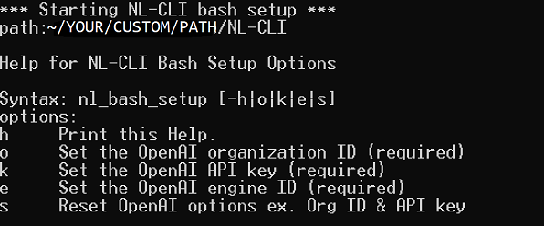

# NL-CLI Installation

In order to leverage the NL-CLI tool, you will need to prepare your environment for the shell of your choice. Installation instructions are shown below for each supported shell environment. 

The following terminal environments are supported:  

* Windows:    [Powershell](#powershell-instructions)
* Linux/WSL:  [Bash](#bash-instructions) 
* Mac OS:     [Zsh](#zsh-instructions)


## Prerequisites


In order to run the NL-CLI, ensure that you have python installed. To install the required python packages, please go to the command line in the shell of your choice and enter the following commands: 

```
python -m pip install openai
python -m pip install psutil
```

Additionally, the OpenAI API key, organization id, and engine id are required to execute the NL-CLI tool. 

To obtain the OpenAI API key information, go to (https://beta.openai.com/account/api-keys) and login into your account. 

Once logged in you will see: 


Copy the API key by clicking the Copy button and save the copied key where you can retrieve it. 

To obtain the OpenAI organization id, go to OpenAI Settings page (https://beta.openai.com/account/org-settings) and copy the id shown underneath the Organization ID heading. Save the copied id with the API key that was stored in previous step. 

See image below for reference: 


To obtain the OpenAI engine id, go to OpenAI Engines page (https://beta.openai.com/docs/engines/codex-series-private-beta) for the engines available for Codex models. Select the desired engine and save the engine id with the API key and organization id stored in previous steps. 

See image below for reference: 


## Bash instructions

To leverage the NL-CLI on WSL and Linux environments using Bash please follow the steps below: 

1. Open Bash shell and download the NL-CLI project to your desired location in Linux by cloning the NL-CLI repo using the following command: 
```
    $ git clone https://github.com/microsoft/NL-CLI.git /your/custom/path/
```

2. Once you have the project cloned. Go to the directory that contains the NL-CLI code.

```
	cd </your/custom/path>/NL-CLI
```

3. Setup your Bash NL-CLI environment.

	In the NL-CLI folder, there is a folder named scripts.
	Within the scripts folder is the shell script,
	`bash_setup.sh`, which is used to setup the Bash environment.
	
	To run this setup, enter the OpenAI API key, OpenAI organization id, and the OpenAI engine id as these are required settings. 

Run the following commands to execute setup:
```
cd scripts
source ./bash_setup.sh -o <OPENAI ORG ID> -k <OPENAI API KEY> -e <OPENAI ENGINE ID>
```

This setup will create an OpenAI config file and update your bash environment. 

4. Open a new Bash terminal. Type in `#` followed by your natural language request. Press Ctrl+g to execute!

### Clean up
Once you have finished using the NL-CLI tool, go to the folder that contains the NL-CLI code. ex `cd ~/your/custom/path/NL-CLI`. Run the following command to clean up the NL-CLI bash environment.
```
source ./scripts/bash_cleanup.sh
```

### About bash_setup.sh
The `bash_setup.sh` scripts supports the following parameters:
| Parameter | Description |
|--|--|
| `-o`  | Required. Your [OpenAI Organization Id](https://beta.openai.com/account/org-settings). |
| `-k`  | Required. Your [OpenAI API key](https://beta.openai.com/account/api-keys). |
|`-e` | Required. The [OpenAI Engine Id](https://beta.openai.com/docs/engines/codex-series-private-beta).|
|`-s` | Optional. Reset the OpenAI API key, Organization ID and Engine ID. This will rewrite the OpenAI config with new settings.|
| `-h` | Optional. Display help for the Bash NL-CLI tool setup. *(see info below for running help)*`|

For help running the NL-CLI Bash setup, please run the following command:   
```
source ./bash_setup.sh -h
```




## Zsh instructions


1. Download this project to `~/your/custom/path/`.

```
    $ git clone https://github.com/microsoft/NL-CLI.git ~/your/custom/path/
```

2. In zsh, go to `~/your/custom/path/` (the folder contains NL-CLI code), then run the following command to setup your zsh environment. It will prompt you for [OpenAI API key]((https://beta.openai.com/account/api-keys)).

```
./scripts/zsh_setup.sh --OpenAIOrganizationId <YOUR_ORG_ID> --OpenAIEngineId <ENGINE_ID>
```
&nbsp;&nbsp;&nbsp;&nbsp;&nbsp;&nbsp;&nbsp;&nbsp;&nbsp;&nbsp;See [About zsh_setup.sh](#about-zshsetupsh) section to learn script parameters.

3. Run `zsh`, start typing and complete it using `^G`!

### Clean up
Once you are done, go to `~/your/custom/path/` (the folder contains NL-CLI code), then run the following command to clean up.
```
./scripts/zsh_cleanup.sh
```

### About zsh_setup.sh
`zsh_setup.sh` supports the following parameters:
| Parameter | Description |
|--|--|
| `--OpenAIOrganizationId` | Required. Your [OpenAI organization Id](https://beta.openai.com/account/org-settings). |
|`--OpenAIEngineId` | Required. The [OpenAI engine Id](https://beta.openai.com/docs/engines/codex-series-private-beta) that provides access to a model.|
| `--RepoRoot` | Optional. Default to the current folder.<br/>The value should be the path of NL-CLI folder. Example:<br/>`./zsh_setup.sh --RepoRoot /Code/NL-CLI`|

## Powershell instructions

1. Download this project to wherever you want `C:\your\custom\path\`.

```
    $ git clone https://github.com/microsoft/NL-CLI.git C:\your\custom\path\
```

2. Open PowerShell as Administrator and run the following command.

```
Set-ExecutionPolicy RemoteSigned -Scope CurrentUser
```


3. In the same Powershell window, go to `C:\your\custom\path\NL-CLI\` (the folder contains NL-CLI code). Copy the following command then replace `YOUR_OPENAI_ORGANIZATION_ID` and `ENGINE_ID` with your OpenAI organization Id and OpenAI engine Id. Run the command to setup your PowerShell environment. It will prompt you for OpenAI access key.

```
.\scripts\powershell_setup.ps1 -OpenAIOrganizationId "YOUR_OPENAI_ORGANIZATION_ID" -OpenAIEngineId "ENGINE_ID"
```
&nbsp;&nbsp;&nbsp;&nbsp;&nbsp;&nbsp;&nbsp;&nbsp;&nbsp;&nbsp;See [About powershell_setup.ps1](#about-powershell_setupps1) section to learn script parameters.

4. Open a new PowerShell session, type in `#` followed by your natural language command and hit Ctrl + G!

### Clean up
Once you are done, go to `C:\your\custom\path\` (the folder contains NL-CLI code), then run the following command to clean up.
```
.\scripts\powershell_cleanup.ps1
```

If you want to revert the execution policy, run this command
```
Set-ExecutionPolicy Undefined -Scope CurrentUser
```

### About powershell_setup.ps1
`powershell_setup.ps1` supports the following parameters:
| Parameter | Type | Description |
|--|--|--|
| `-OpenAIApiKey` | [SecureString](https://docs.microsoft.com/en-us/dotnet/api/system.security.securestring) | Required. If is not supplied, the script will prompt you to input the value. To provide the value via PowerShell parameter, this is an example for PowerShell 7: <br/> `.\scripts\powershell_setup.ps1 -OpenAIApiKey (ConvertTo-SecureString "YOUR_OPENAI_API_KEY" -AsPlainText -Force)` | 
| `-OpenAIOrganizationId` | String | Required. Your [OpenAI organization Id](https://beta.openai.com/account/org-settings). |
| `-OpenAIEngineId` | String | Required. The [OpenAI engine Id](https://beta.openai.com/docs/engines/codex-series-private-beta) that provides access to a model.|
| `-RepoRoot` | [FileInfo](https://docs.microsoft.com/en-us/dotnet/api/system.io.fileinfo) | Optional. Default to the current folder.<br>The value should be the path of NL-CLI folder. Example:<br/>`.\scripts\powershell_setup.ps1 -RepoRoot 'C:\your\custom\path'`|
