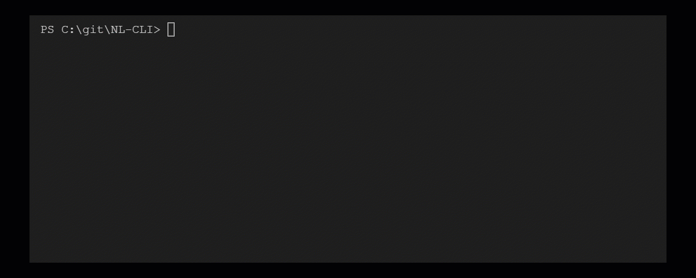

# NL-CLI - Natural Language Command Line Interface

This project uses Codex to convert natural language commands into commands in PowerShell, Zshell and Bash. 



Type in `#` followed by your natural language command, hit Ctrl+X and watch Codex turn it into scripting code.

With the added functionality for loading developing 'modes', it makes the experience of working in the terminal seamless.

Inspired by the [zsh_codex](https://github.com/tom-doerr/zsh_codex) project, it expands the functionality to multiple shells and adds the ability to load prompts for better model performance.

## Requirements
* [Python](https://www.python.org/downloads/)
    * \[Windows\]: Python is added to PATH.
* An [OpenAI account](https://openai.com/api/) with OpenAI API Key, OpenAI Organization Id, and OpenAI Engine Id.

## Installation
Make sure you have python installed. Then install needed python packages.

```
pip3 install openai
pip3 install psutil
```

Follow the steps for which shell you are using. Generally, Mac OS has zsh, Linux has bash, Windows has powershell.

### Zsh instructions


1. Download this project to `~/your/custom/path/`.

```
    $ git clone https://github.com/microsoft/NL-CLI.git ~/your/custom/path/
```

2. In zsh, go to `~/your/custom/path/` (the folder contains NL-CLI code), then run the following command to setup your zsh environment. It will prompt you for [OpenAI API key]((https://beta.openai.com/account/api-keys)).

```
./scripts/zsh_setup.sh --OpenAIOrganizationId <YOUR_ORG_ID> --OpenAIEngineId <ENGINE_ID>
```
&nbsp;&nbsp;&nbsp;&nbsp;&nbsp;&nbsp;&nbsp;&nbsp;&nbsp;&nbsp;See [About zsh_setup.sh](#about-zshsetupsh) section to learn script parameters.

3. Run `zsh`, start typing and complete it using `^X`!

#### Clean up
Once you are done, go to `~/your/custom/path/` (the folder contains NL-CLI code), then run the following command to clean up.
```
./scripts/zsh_cleanup.sh
```

#### About zsh_setup.sh
`zsh_setup.sh` supports the following parameters:
| Parameter | Description |
|--|--|
| `--OpenAIOrganizationId` | Required. Your [OpenAI organization id](https://beta.openai.com/account/org-settings).<br/>If you have multiple organizations, please update your [default organization](https://beta.openai.com/account/api-keys) to the one that has access to codex engines before getting the organization id. |
|`--OpenAIEngineId` | Required. The [OpenAI engine id](https://beta.openai.com/docs/engines/codex-series-private-beta) that provides access to a model. For example, `code-davinci-002` or `code-cushman-001`.<br/>See [here](#what-openai-engines-are-available-to-me) for checking available engines.|
| `--RepoRoot` | Optional. Default to the current folder.<br/>The value should be the path of NL-CLI folder. Example:<br/>`./zsh_setup.sh --RepoRoot /Code/NL-CLI`|

### Powershell instructions

1. Download this project to wherever you want `C:\your\custom\path\`.

```
    $ git clone https://github.com/microsoft/NL-CLI.git C:\your\custom\path\
```

2. Open PowerShell as Administrator and run the following command.

```
Set-ExecutionPolicy RemoteSigned -Scope CurrentUser
```


3. In the same Powershell window, go to `C:\your\custom\path\` (the folder contains NL-CLI code), then run the following command to setup your PowerShell environment. It will prompt you for OpenAI access key.

```
.\scripts\powershell_setup.ps1 -OpenAIOrganizationId "YOUR_OPENAI_ORGANIZATION_ID" -OpenAIEngineId "ENGINE_ID"
```
&nbsp;&nbsp;&nbsp;&nbsp;&nbsp;&nbsp;&nbsp;&nbsp;&nbsp;&nbsp;See [About powershell_setup.ps1](#about-powershellsetupps1) section to learn script parameters.

4. Open a new powershell session, type in `#` followed by your natural language command and hit Ctrl+X!

#### Clean up
Once you are done, go to `C:\your\custom\path\` (the folder contains NL-CLI code), then run the following command to clean up.
```
.\scripts\powershell_cleanup.ps1
```

If you want to revert the execution policy, run this command
```
Set-ExecutionPolicy Undefined -Scope CurrentUser
```

#### About powershell_setup.ps1
`powershell_setup.ps1` supports the following parameters:
| Parameter | Type | Description |
|--|--|--|
| `-OpenAIApiKey` | [SecureString](https://docs.microsoft.com/en-us/dotnet/api/system.security.securestring) | Required. If is not supplied, the script will prompt you to input the value. To provide the value via PowerShell parameter, this is an example for PowerShell 7: <br/> `.\scripts\powershell_setup.ps1 -OpenAIApiKey (ConvertTo-SecureString "YOUR_OPENAI_API_KEY" -AsPlainText -Force)` | 
| `-OpenAIOrganizationId` | String | Required. Your [OpenAI organization id](https://beta.openai.com/account/org-settings).<br/>If you have multiple organizations, please update your [default organization](https://beta.openai.com/account/api-keys) to the one that has access to codex engines before getting the organization id. |
| `-OpenAIEngineId` | String | Required. The [OpenAI engine id](https://beta.openai.com/docs/engines/codex-series-private-beta) that provides access to a model. For example, `code-davinci-002` or `code-cushman-001`.<br/>See [here](#what-openai-engines-are-available-to-me) for checking available engines. |
| `-RepoRoot` | [FileInfo](https://docs.microsoft.com/en-us/dotnet/api/system.io.fileinfo) | Optional. Default to the current folder.<br>The value should be the path of NL-CLI folder. Example:<br/>`.\scripts\powershell_setup.ps1 -RepoRoot 'C:\your\custom\path'`|

### Bash instructions


1. Download this project to `~/your/custom/path/`.

```
    $ git clone https://github.com/microsoft/NL-CLI.git ~/your/custom/path/
```

2. Add the following to your `~/.bashrc` file.

```
    # in your/custom/path you need to clone the repository
    export NL_CLI_PATH="your/custom/path/NL-CLI"
    source "$NL_CLI_PATH/scripts/nl_cli.plugin.sh"
    bind -x '"\C-x":"create_completion"'
```

3. Create a file called `openaiapirc` in `~/.config` with your SECRET_KEY.

```
[openai]
organization_id=...
secret_key=...
engine=...
```

4. Run `bash`, start typing and complete it using `^X`!


## Usage

When an input is provided to the CLI, we first check if it is a command. 

If it is, we execute the command and exit. 

If it is not a command, we prefix the input with the shell name, the interactions in `current_context.txt` and pass it to Codex (which uses the context config). 

Depending on whether multi-turn mode is on or off and the interaction was successful, we add the interaction to the current context file, letting you build off on interactions.

## Commands

| Command | Description |
|--|--|
| `start multi-turn` | Starts a multi-turn experience |
| `stop multi-turn` | Stops a multi-turn experience and loads default context |
| `load context <filename>` | Loads the context file from `contexts` folder |
| `default context` | Loads default shell context |
| `view context` | Opens the context file in a text editor |
| `save context <filename>` | Saves the context file to `contexts` folder, if name not specified, uses current date-time |
| `show config` | Shows the current configuration of your interaction with the model |
| `set <config-key> <config-value>` | Sets the configuration of your interaction with the model |
| `unlearn` | Unlearns the last two lines of input-output from the model |


## Context file system
The context being provided to the model is specified in `current_context.txt`.

All contexts are loaded from the `contexts` folder. There are some shell defaults that we have added to get you started.

You can create your own contexts using the multi-turn feature and the `save context` command. Otherwise, you can simply paste in your favorite prompt files into the `contexts` folder and load them in using the `load context <filename>` command.

One important thing to consider is that if you add a new context, keep the multi-turn mode on to avoid our automatic defaulting (added to keep faulty contexts from breaking your experience).

You can change the default context from our shell defaults to your context file inside `src\prompt_file.py`.

## Troubleshooting

Use `DEBUG_MODE` to use a terminal input instead of the stdin and debug the code. This is useful when adding new commands and understanding why the tool is unresponsive.

Sometimes `openai` will throws errors that aren't caught by the tool, you can add a catch block at the end of `codex_query.py` for that exception and print a custom error message.

## FAQ
### What OpenAI engines are available to me?
You might have access to different [OpenAI engines](https://beta.openai.com/docs/api-reference/engines) per OpenAI organization. To check what engines are available to you, one can query the [List engines API](https://beta.openai.com/docs/api-reference/engines/list) for available engines. See the following commands:

* Shell
```
curl https://api.openai.com/v1/engines \
  -H 'Authorization: Bearer YOUR_API_KEY' \
  -H 'OpenAI-Organization: YOUR_ORG_ID'
```

* Windows Command Prompt (cmd)
```
curl --ssl-no-revoke https://api.openai.com/v1/engines --header OpenAI-Organization:YOUR_ORG_ID --oauth2-bearer YOUR_API_KEY
```